# DJAY Bot SaaS — System Map, Pages, and User Flows

This is the source-grounded map of the approved target experience and the current SaaS implementation in `DJAY_Bot_SaaS_Platform`.

It answers four questions:

1. How the multi-tenant platform is connected.
2. How a merchant registers, pays, and becomes live.
3. How a merchant's end customer is handled by FlowBot, AI Text Bot, or AI Voice Bot.
4. How DJAI SaaS operators manage merchants, billing, providers, incidents, and support.

## How to read this map

- Solid paths and the **Current source** labels describe pages and services present in the current repository.
- Dashed paths and **Target UX** labels describe the intended market-release experience in the authoritative UX plan. Some target screens are not separate routes yet.
- There are three bot families, each with Starter and Advanced packages: Flow Bot, AI Text Bot, and AI Voice Bot.
- A tenant can subscribe to more than one family. Each family keeps its own lifecycle, deployment, and usage meter while sharing the workspace's customer and operations layer.

Source documents:

- [Market-release architecture](./djay-bots-v1-market-release-architecture.md)
- [Approved experience contract](../design/djay-bots-approved-experience-contract.md)
- [Approved clickable visual reference](../design/djay-bot-text-voice-configuration-flow.html)
- [UI/UX and user-flow plan](../design/djay-bots-v1-ui-ux-and-user-flows.md)
- [Market-release product requirements](../product/djay-bots-v1-market-release-prd.md)
- [Current tenant navigation](../../apps/tenant-web/app/workspace/WorkspaceSidebar.tsx)
- [Current Platform Master navigation](../../apps/platform-master/app/PlatformNavigation.tsx)

## 1. Executive mind map

```mermaid
flowchart TB
    DJAY["DJAY BOT SaaS\nOne multi-tenant conversation platform"]

    DJAY --> PUBLIC["Public realm\nProspects, registration, checkout, legal"]
    DJAY --> TENANT["Tenant realm\nMerchant workspace"]
    DJAY --> PLATFORM["Platform realm\nDJAI SaaS operations"]
    DJAY --> RUNTIME["Customer runtime\nWebsite, social, and voice"]
    DJAY --> CORE["Shared platform core\nAPI, database, workers, gateways"]

    PUBLIC --> P1["Product comparison\nFlow / Text / Voice"]
    PUBLIC --> P2["Register / verify / sign in"]
    PUBLIC --> P3["Checkout / return / billing truth"]
    PUBLIC --> P4["Terms / Privacy / Status / recovery"]

    TENANT --> T1["Overview + setup"]
    TENANT --> T2["Flow Bot Studio"]
    TENANT --> T3["AI Text Studio"]
    TENANT --> T4["AI Voice Studio"]
    TENANT --> T5["Inbox / Leads / Contacts"]
    TENANT --> T6["Knowledge / channels / integrations"]
    TENANT --> T7["Usage / billing / team / security / data"]

    T2 --> B1["Deterministic journeys"]
    T3 --> B2["Grounded AI sales conversations"]
    T4 --> B3["Web and telephone voice conversations"]

    PLATFORM --> A1["Command center + Tenant 360"]
    PLATFORM --> A2["Subscriptions, checkout, provisioning"]
    PLATFORM --> A3["Usage, overage, finance, accounting"]
    PLATFORM --> A4["Provider, voice, channel, release operations"]
    PLATFORM --> A5["Jobs, dead letters, support access, audit"]

    RUNTIME --> R1["Flow widget / social Flow"]
    RUNTIME --> R2["AI Text widget / social AI"]
    RUNTIME --> R3["Voice widget / telephone Voice"]
    RUNTIME --> R4["Shared conversations, contacts, leads, handover"]

    CORE --> C1["Tenant-aware API"]
    CORE --> C2["PostgreSQL + forced RLS"]
    CORE --> C3["Workers + outbox + reconciliation"]
    CORE --> C4["AI gateway + Voice gateway"]
    CORE --> C5["Stripe / LINE / Meta / email / storage / telephony adapters"]
```
## 2. Multi-tenant architecture

### 2.1 Runtime topology

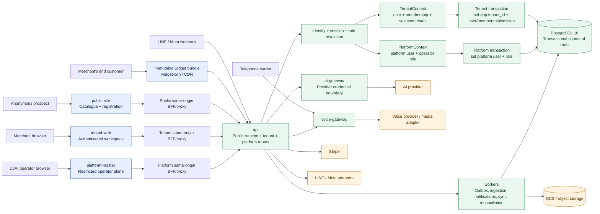

### 2.2 Tenant boundary: the important link

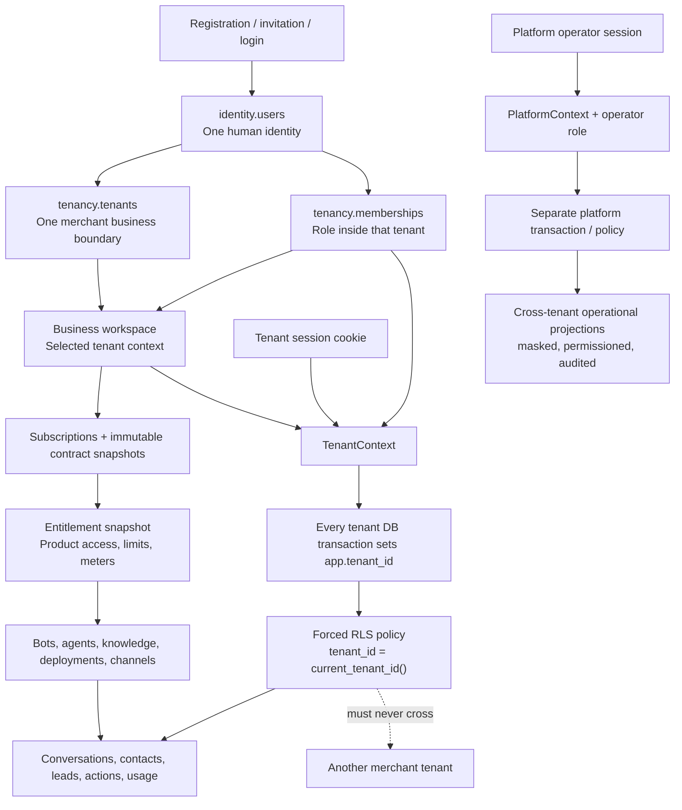

The isolation model is layered rather than trusting a browser filter:

| Layer | What it does |
| --- | --- |
| Identity | Authenticates the human and manages sessions, email verification, MFA, recovery, and invitations. |
| Membership | Maps the human to a tenant and role. One human can belong to multiple workspaces. |
| Tenant context | Resolves the selected workspace on every authenticated tenant request. |
| Authorization | Checks the role permission and recent-authentication requirement for sensitive actions. |
| Database transaction | Sets the tenant context inside the transaction before repository work starts. |
| Forced RLS | Filters and validates tenant-owned rows using `tenant_id = tenancy.current_tenant_id()`. |
| Entitlements | Checks the active subscription, limits, usage funding, and safety caps before allocating resources. |
| Audit/idempotency | Records mutations and prevents duplicate checkout, delivery, actions, usage, and provisioning. |

The browser never receives database, Stripe, AI-provider, accounting, or cross-tenant credentials.

### 2.3 Shared versus product-specific data

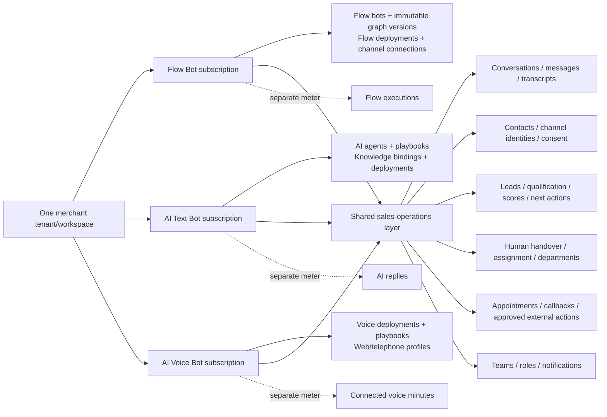

## 3. Merchant signup, purchase, and onboarding flow

### 3.1 Account and commerce flow

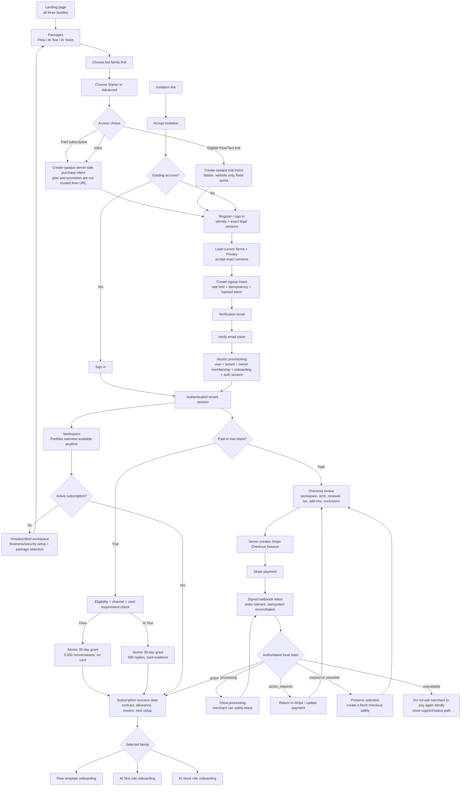

**Current source note:** the current public page already loads the catalog, legal versions, and registration form; the current tenant workspace exposes subscriptions/usage and checkout routes. The complete comparison, checkout-review, return/resume, and lifecycle presentation is still a target UX surface.

### 3.2 Shared onboarding shell

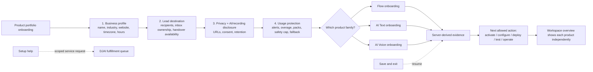

Onboarding and lifecycle labels are evidence-based, but the dashboard remains available before configuration completion. Missing review and unrun suggested tests are advisory and never forced completion gates. Publication/activation blocks only for applicable technical, security, legal, entitlement, origin, or external-action invariants.

### 3.3 Flow Bot onboarding

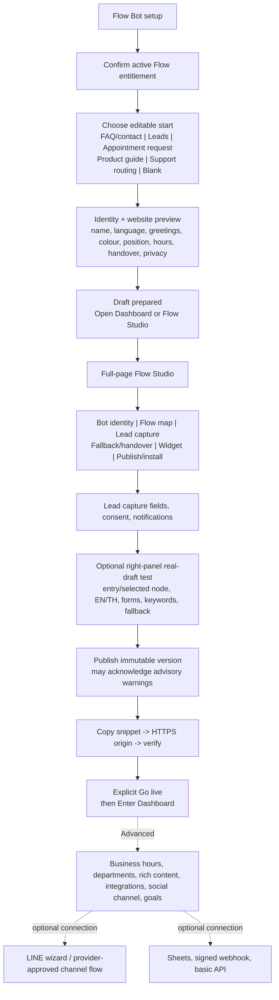

Current source pages: `/workspace/setup`, `/workspace/flowbot`, `/workspace/flowbot/canvas`, and `/workspace/flowbot/connect/line`.

### 3.4 AI Text Bot onboarding

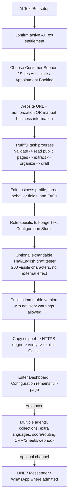

Current source page: `/workspace/ai-chat`. Knowledge is a shared workspace page at `/workspace/knowledge`; AI Text also manages deployments, notifications, analytics, and social connections from its Studio.

### 3.5 AI Voice Bot onboarding

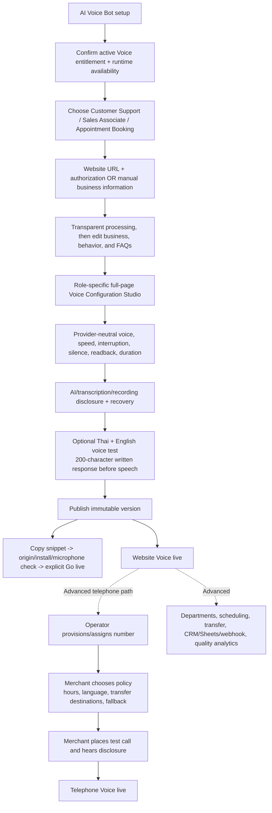

Current source page: `/workspace/voice`. Carrier provisioning, SIP/media bridging, provider routing, and carrier-cost reconciliation stay on the operator side.

### 3.6 Combined-product flow

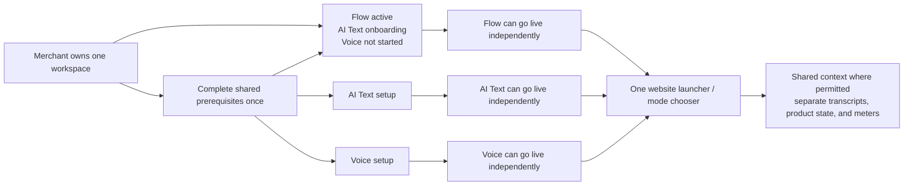

## 4. Merchant page map

### 4.0 Approved page ownership

| Realm | Approved page/surface | Product scope |
| --- | --- | --- |
| Public | Landing | All three families |
| Public | Packages | All three families; family then package then subscribe/trial |
| Public/identity | Account, legal acceptance, paid checkout or trial provisioning | Selected family/access |
| Tenant onboarding | Flow starting journey, identity, ready summary | Flow only |
| Tenant onboarding | Role, source, processing, editable generated review | AI Text only or AI Voice only |
| Tenant | Flow Configuration Studio | Flow only |
| Tenant | AI Text Configuration Studio | Text only |
| Tenant | AI Voice Configuration Studio | Voice only |
| Tenant | Merchant Dashboard | Shared shell with current product context |
| Customer | Website widget | Deployed product/mode only |

Dashboard pages are Overview, Conversations, Conversation detail, Contacts, Leads and follow-up, Appointments, Analytics, Configuration, and Usage and plan. Configuration is not a small dashboard panel; it routes back to the relevant full-page Studio. Dashboard access is allowed while Configuration shows `Not configured`.

### 4.1 Current public and identity pages

| Current path | Page responsibility |
| --- | --- |
| `public-site /` | Business-outcome landing page presenting Flow, AI Text and AI Voice and leading to Packages. Registration is not embedded here. |
| `public-site /pricing` | Catalog-driven family/package comparison and approved commercial continuation. |
| `public-site /register` | Account registration after a package/purchase intent or direct account entry. |
| `public-site /templates` | Business use cases across the product families. |
| `public-site /help` | Public product help and recovery guidance. |
| `public-site /login` | Redirects to the tenant login realm. |
| `public-site /verify-email` | Verify the signup token and continue to the tenant workspace. |
| `public-site /invitations/accept` | Accept an invitation; routes an existing account to sign-in when needed. |
| `public-site /terms` | Current Terms of Service. |
| `public-site /privacy` | Current Privacy Notice. |
| `public-site /status` | Public service status. |
| `tenant-web /` | Business-account login and MFA challenge. |
| `tenant-web /recovery` | Request password recovery. |
| `tenant-web /recovery/complete` | Complete password recovery and revoke prior sessions. |
| `tenant-web /invitations/accept` | Complete invitation acceptance after existing-account sign-in. |
| `tenant-web /ownership/accept` | Accept an ownership transfer. |

### 4.2 Current merchant workspace pages

| Current path | What the merchant does there |
| --- | --- |
| `/workspace` | Select a workspace, see product lifecycle/readiness, onboarding checklist, subscriptions, and next action. |
| `/workspace/setup` | Flow setup wizard with profile, access, configure, deploy, test, and launch evidence. |
| `/workspace/flowbot` | Flow Bot Studio: bots, drafts, visual/linear authoring, versions, deployments, analytics, notifications, routing, schedules, integrations, and channel controls. |
| `/workspace/flowbot/canvas` | Flow graph/canvas editor and validation. |
| `/workspace/flowbot/connect/line` | Authenticated LINE connection wizard. |
| `/workspace/ai-chat` | AI Text Studio: agent/playbook, knowledge bindings, preview/test, publish, deployments, analytics, notifications, and social connections. |
| `/workspace/voice` | Voice Studio: voice/deployment identity, playbook, knowledge, entry rules, disclosure, transfer, actions, test, quality, and deploy controls. |
| `/workspace/inbox` | Shared conversations, messages, handover, assignment, reply, notes, lead/outcome context. |
| `/workspace/contacts` | Contacts, channel identities, consent, tags, attributes, duplicate-review candidates. |
| `/workspace/leads` | Lead list, status, source, product/channel, score, owner, next action. |
| `/workspace/knowledge` | Shared knowledge sources, revisions, ingestion state, bindings, and business facts. |
| `/workspace/operations` | Setup services, add-ons, professional-service requests, and fulfillment status. |
| `/workspace/settings` | Business profile, locale, timezone, website and workspace settings. |
| `/workspace/team` | Members, invitations, roles, seat capacity, ownership administration. |
| `/workspace/usage` | Product meters, allowances, usage, caps, alerts, packs, checkout return state, billing portal/plan actions. |
| `/workspace/data` | Data export, scoped contact erasure, retention and privacy jobs. |
| `/workspace/security` | MFA/security sessions, session revocation, and security state. |

### 4.3 Target UX pages that are not all separate current routes yet

The target information architecture also calls for these job-oriented views:

```text
Public:
  Business-outcome Landing
  Family/package Pricing with paid/trial choice
  Flow Bot family detail
  AI Text Bot family detail
  AI Voice Bot family detail
  Setup services
  Enterprise
  Checkout review
  Checkout return / resume

Tenant:
  Unsubscribed overview
  Subscription-success landing
  Flow starting-journey / identity / ready onboarding
  Separate Text and Voice role / source / processing / editable-review onboarding
  Flow full-page Configuration Studio and right-panel tester
  AI Text full-page role-specific Configuration Studio and right-panel tester
  AI Voice full-page role-specific Configuration Studio and Voice tester
  Merchant Dashboard: Overview / Conversations / Contacts / Leads / Appointments / Analytics / Configuration / Usage
  Channels
  Integrations
  Appointments and callbacks
  Analytics
  Notifications / activity
  Billing and invoices
  Brand and widget settings
```

The current implementation keeps several of these as panels inside the three product Studios or inside `/workspace/usage`. The target plan calls for stable, deep-linkable job routes without duplicating domain logic.

## 5. End-customer journey: how the solution helps the merchant's customer

### 5.1 Shared website launcher

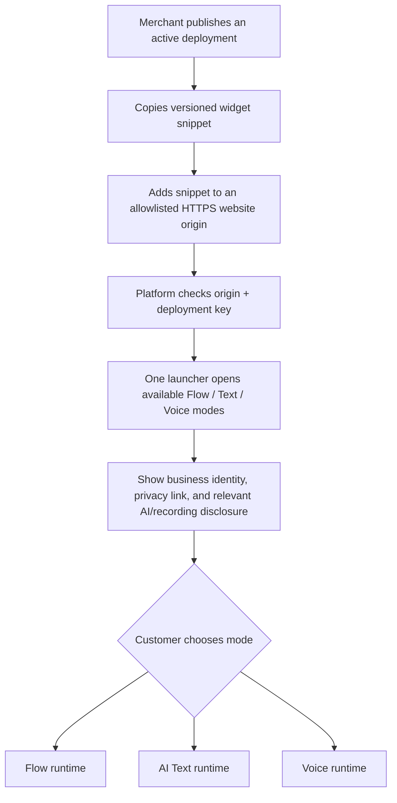

The widget is isolated from the host site's CSS, uses exact-origin authorization, and never receives merchant database or provider credentials.

### 5.2 Flow Bot customer path

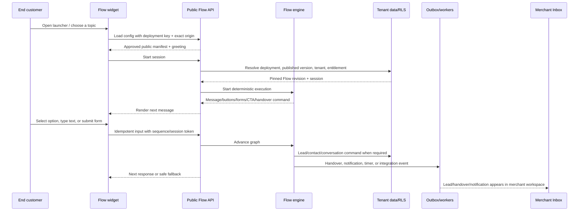

Flow Bot does not silently invoke AI for unknown text. It follows the configured matching/fallback/handover rules.

### 5.3 AI Text customer path

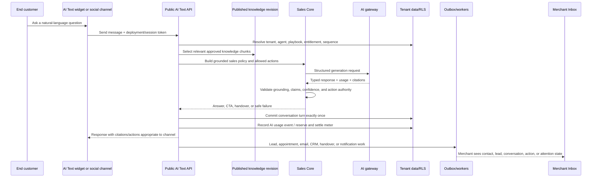

Low-confidence answers can route to a human. The customer sees an honest pending/failure/fallback state; retries do not create duplicate replies or usage events.

The committed customer-facing reply is no more than 200 visible characters. At 100 remaining replies in a Text trial, the owner receives the approved in-platform and email warning. At exhaustion/expiry the runtime stops new AI replies and uses the merchant-approved fallback without exposing providers or internal quota identifiers.

### 5.4 Voice customer path

```mermaid
sequenceDiagram
    participant C as End customer
    participant W as Voice widget / caller
    participant API as Public Voice API
    participant VG as Voice gateway
    participant VR as Voice runtime/provider adapter
    participant D as Tenant data/RLS
    participant O as Workers
    participant M as Merchant Inbox

    C->>W: Open voice or call assigned number
    W->>API: Request session grant
    API->>D: Resolve deployment, origin/number, tenant, capacity, cap, disclosure
    API-->>W: Short-lived opaque grant + gateway URL + policy
    W->>VG: Connect with grant and protocol version
    VG->>D: Authorize, reserve concurrency, open voice session
    VG->>VR: Provider-neutral media/session contract
    VR-->>VG: Disclosure, speech, transcript deltas, action status
    VG-->>W: Audio, transcript, interruption, warning, transfer, and status events
    C->>W: Speak, interrupt, request callback/transfer/appointment, or end
    VG->>D: Commit turns, actions, transcript state, and outcome
    C->>W: End or disconnect
    VG->>D: Settle connected seconds/minutes exactly once; release unused reservation
    O-->>M: Summary, lead, callback/appointment, transcript state, usage, and outcome
```

Voice cannot speak before the required automated-agent disclosure. Reconnect, capacity, time limits, transfer failure, and provider unavailability are explicit states.

The written response is validated to no more than 200 visible characters before speech output.

### 5.6 Merchant live takeover path

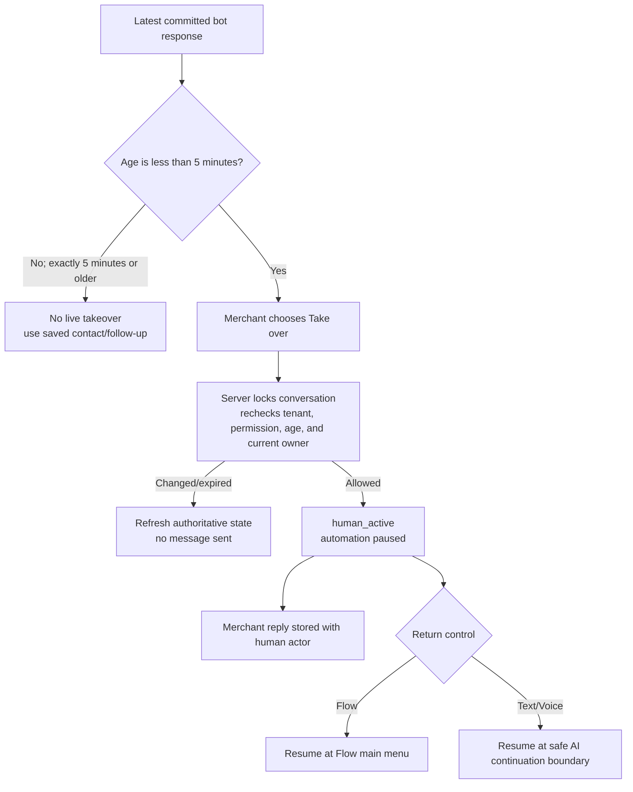

### 5.5 Social and human handover path

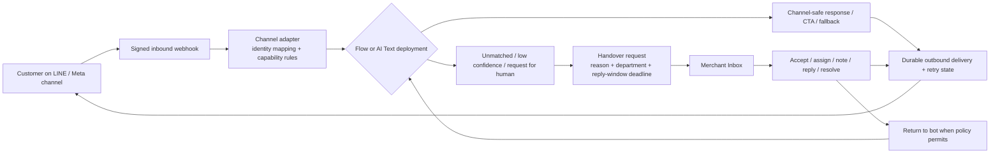

## 6. SaaS-admin flow: how DJAI manages merchants

### 6.1 Current Platform Master surface

The current `platform-master` app is a role-aware operator dashboard with anchor sections rather than fully split routes:

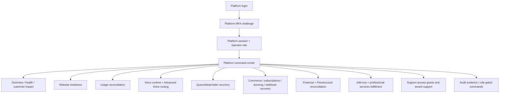

Current navigation anchors are `#overview`, `#release-operations`, `#usage-reconciliation`, `#voice-operations`, `#queue-recovery`, `#commerce`, `#fulfillment`, and `#support-access`.

### 6.2 Target Platform Master information architecture

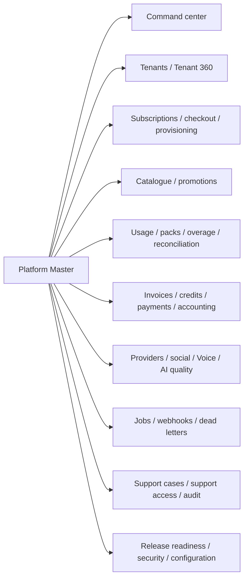

### 6.3 Merchant-management flow

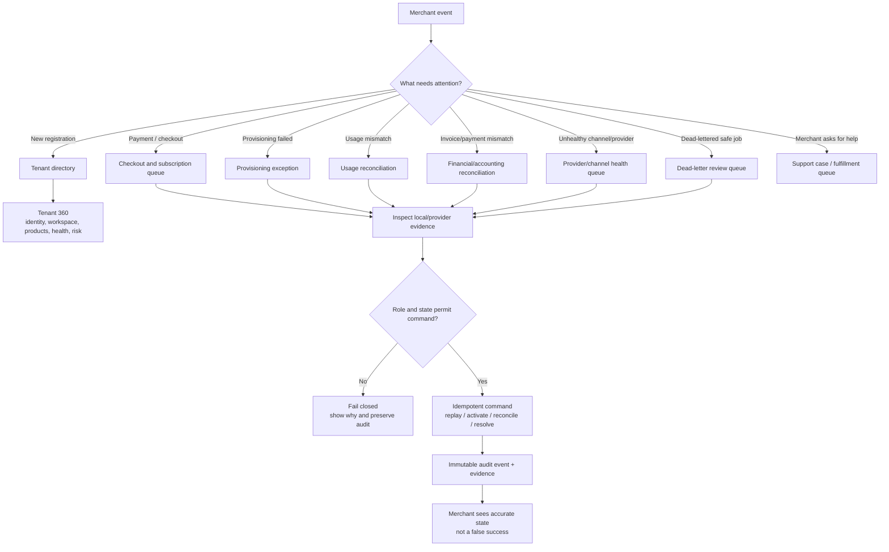

### 6.4 Tenant 360

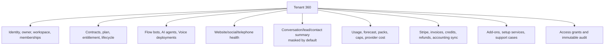

Cross-tenant PII and transcripts are not casually exposed. Viewing sensitive content requires the permitted role, purpose/consent or approved grant, recent authentication where required, and audit evidence.

### 6.5 Support-access flow

```mermaid
sequenceDiagram
    participant S as DJAI Support
    participant P as Platform Master
    participant M as Merchant owner
    participant T as Tenant workspace
    participant A as Audit log

    S->>P: Request tenant support access
    P->>P: Record tenant, reason, scope, duration, requested resources
    P->>M: Ask for consent / approval when required
    M-->>P: Approve or decline
    P->>A: Record approved, time-bounded grant
    P->>T: Show visible support-access banner
    S->>T: Use normal tenant UI with scoped grant
    T->>A: Audit sensitive reads and writes
    P->>A: Revoke or expire grant
    P-->>T: Access removed automatically
```

### 6.6 Provider, Voice, and release safety flow

```mermaid
flowchart TD
    PROPOSE["AI/Voice operator proposes candidate or routing change"] --> REVIEW["Independent review + evidence hash"]
    REVIEW --> QUALIFY{"Qualified?"}
    QUALIFY -->|"No"| REJECT["Reject and keep current route"]
    QUALIFY -->|"Yes"| CANARY["Request canary"]
    CANARY --> ADMIT["Independent admission decision"]
    ADMIT --> ACTIVE["Activate controlled traffic"]
    ACTIVE --> MONITOR["Observe health, latency, queue, incidents, cost"]
    MONITOR --> INCIDENT{"Incident?"}
    INCIDENT -->|"No"| STABLE["Remain active"]
    INCIDENT -->|"Yes"| SAFE["Pause / emergency stop / rollback"]
    SAFE --> INCIDENTQ["Open incident + credit review if needed"]
    INCIDENTQ --> RESOLVE["Authorized resolution + evidence"]
    RESOLVE --> MONITOR
```

## 7. Current page-to-service linkage

```mermaid
flowchart LR
    PUBLICPAGES["Public pages"] --> PUBLICAPI["/public/* API"]
    TENANTPAGES["Tenant workspace pages"] --> TENANTAPI["/tenant/* API"]
    PLATFORMPAGES["Platform Master"] --> PLATFORMAPI["/platform/* API"]

    PUBLICAPI --> AUTH["Identity/auth"]
    PUBLICAPI --> CATALOGAPI["Catalog/legal/status"]
    PUBLICAPI --> RUNTIMEAPI["Flow / AI Text / Voice public runtime"]
    TENANTAPI --> AUTH
    TENANTAPI --> COMMERCEAPI["Subscriptions / checkout / usage / billing"]
    TENANTAPI --> PRODUCTAPI["Flow / AI Text / Voice authoring + deployment"]
    TENANTAPI --> DOMAINAPI["Inbox / contacts / leads / knowledge / privacy"]
    PLATFORMAPI --> OPSAPI["Health / billing / reconciliation / support / routing / recovery"]

    PRODUCTAPI --> ENT["Entitlement and resource boundary checks"]
    ENT --> DB2[("Tenant-scoped PostgreSQL repositories")]
    RUNTIMEAPI --> DB2
    DOMAINAPI --> DB2
    COMMERCEAPI --> STRIPE2["Stripe adapter + signed webhooks"]
    PRODUCTAPI --> WORKER2["Workers / outbox / notifications / integrations"]
    RUNTIMEAPI --> AI2["AI gateway / Voice gateway when applicable"]
```

Important route families in the current API:

```text
Public auth/catalog/legal:
  /public/auth/*, /public/catalog, /public/legal, /public/status

Flow runtime:
  /public/flowbot/config
  /public/flowbot/session
  /public/flowbot/message
  /public/flowbot/sync
  /public/flowbot/social/line/:webhookKey
  /public/flowbot/social/messenger/:webhookKey

AI Text runtime:
  /public/ai-chat/config
  /public/ai-chat/session
  /public/ai-chat/message
  /public/ai-chat/sync
  /public/ai-chat/social/line/:webhookKey
  /public/ai-chat/social/messenger/:webhookKey
  /public/ai-chat/social/whatsapp/:webhookKey

Voice runtime:
  /public/voice/config
  /public/voice/session
  /internal/voice/sessions/*

Tenant operations:
  /tenant/session, /tenant/workspace/select, /tenant/onboarding
  /tenant/flowbot/*, /tenant/ai-chat/*, /tenant/voice/*
  /tenant/knowledge/*, /tenant/conversations/*, /tenant/contacts/*, /tenant/leads
  /tenant/team/*, /tenant/profile, /tenant/usage/*, /tenant/subscriptions/*
  /tenant/billing/*, /tenant/privacy-jobs/*, /tenant/security/*

Platform operations:
  /platform/me, /platform/tenants, /platform/subscriptions
  /platform/commerce-overview, /platform/usage-reconciliation
  /platform/financial-reconciliation, /platform/accounting-reconciliation
  /platform/shared-operations, /platform/support-grants
  /platform/dead-letter-recovery, /platform/webhook-recovery
  /platform/voice/runtime-control, /platform/voice/routing, /platform/voice/incidents
  /platform/release-readiness
```

## 8. What is implemented versus what is still target UX

The local source is a substantial multi-tenant foundation, but the documents intentionally distinguish architecture from commercial readiness.

### Present in the current source

- Separate public, tenant, and platform application realms.
- Tenant sessions, memberships, role permissions, platform roles, MFA paths, invitations, recovery, and ownership transfer.
- PostgreSQL tenant context, forced RLS migrations, scoped transactions, tenant repositories, platform repositories, and cross-tenant isolation tests.
- Three product domains: Flow Bot, AI Text Bot, and AI Voice Bot.
- Merchant pages for Overview, Setup, Flow, AI Text, Voice, Inbox, Contacts, Leads, Knowledge, Operations, Team, Usage, Data, Settings, and Security.
- Public Flow/AI Text/Voice deployment runtimes with exact-origin checks and short-lived/session-scoped runtime state.
- AI gateway boundary, Voice gateway boundary, workers/outbox patterns, usage ledgers, Stripe webhook/billing foundations, social delivery foundations, and operator controls.
- Current Platform Master dashboard sections for health, release readiness, usage, voice, recovery, commerce, fulfillment, and support access.

### Still described as target or gated in the authoritative UX/release documents

- Full six-package self-serve commercial launch and `sellable=true` release evidence.
- Complete public package comparison, checkout review, checkout return/resume, and interrupted-payment lifecycle.
- Separate job-oriented routes for all product onboarding, billing, channels, integrations, analytics, appointments, and notifications; several are currently panels inside larger Studios.
- Full merchant-visible social channel onboarding and launch acceptance for every advertised channel.
- Full telephone Voice provider/number/transfer/scheduling production acceptance.
- Platform Master split into dedicated route-based queues and Tenant 360 pages rather than one long anchor dashboard.
- Named-merchant, legal, provider, operational, and paid-GA acceptance evidence.
- Production implementation of the approved 2026-08-13 end-to-end experience contract, including exact trial state, separate product onboarding, non-blocking advisory review, dedicated Configuration Studios, explicit publish/install/go-live, complete dashboard pages, and server-authoritative five-minute takeover.

The safest mental model is:

```text
Three bot families
  -> one merchant workspace
  -> one shared customer-operations layer
  -> tenant-scoped data and entitlements
  -> separate product runtimes and meters
  -> one DJAI operator plane for support, commerce, providers, and safety
```
